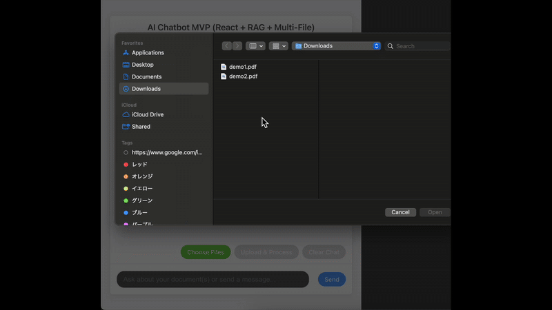

# AI Chatbot: Advanced RAG with Dynamic File Upload & Function Calling (React/Python/LangChain/OpenAI)

## Overview

This third AI portfolio project significantly advances upon previous works by incorporating a dynamic, user-driven RAG system using LangChain, alongside sophisticated multi-tool function calling.

The chatbot is designed to:
* Allow users to **upload their own documents (PDFs, TXTs)** to create a dynamic, personalized knowledge base.
* Answer questions based **solely on the content of the uploaded documents** using an advanced **Retrieval-Augmented Generation (RAG)** pipeline.
* Intelligently **refer to specific documents** mentioned in user queries.
* Perform specific tasks using **Function Calling** (e.g., generating passwords, fetching real-time weather, converting currencies).
* Engage in general conversation.

This project showcases the ability to build practical, AI-driven solutions that can interact with custom data and external tools.

## Demo

Here's a quick demonstration of the chatbot in action, showcasing file uploads for RAG, multi-document querying capabilities, and integrated function calls:

 

*(Caption: This GIF showcases the AI chatbot's core capabilities: 
1. **Dynamic RAG:** Uploading multiple PDF/TXT documents (`demo1.pdf`, `demo2.pdf`) to instantly update its knowledge base.
2. **Contextual Q&A:** Answering questions based on specific content within the uploaded `demo1.pdf` and `demo2.pdf`, demonstrating accurate information retrieval from a multi-document context.
3. **Cross-Document Query Attempt:** Handling a query that refers to both `demo1.pdf` and `demo2.pdf` simultaneously.
4. **Integrated Function Calling:** Seamlessly switching to perform tasks like fetching real-time weather information using an external API.)*
## Features

* **Conversational Interface:**
    * Simple, responsive chat UI built with React.
    * Clear display of conversation history, including AI's information sources for RAG responses.
    * Loading and error indicators.
    * Chat history clearing functionality.
* **Dynamic RAG (Retrieval-Augmented Generation) with LangChain:**
    * **User File Uploads:** Allows users to upload PDF and TXT files to serve as the knowledge base.
    * **Document Processing Pipeline:**
        * **Loading:** Uses LangChain's `PyPDFLoader` and `TextLoader` to ingest document content.
        * **Splitting:** Employs `RecursiveCharacterTextSplitter` to break documents into manageable chunks.
        * **Embedding:** Leverages `OpenAIEmbeddings` (e.g., `text-embedding-3-small`) to convert text chunks into vector representations.
        * **Vector Storage & Retrieval:** Utilizes **FAISS** as a vector store to efficiently store and search document embeddings. The FAISS index is persisted locally.
        * **Retriever Logic:** Employs **FAISS** for efficient **similarity search**, retrieving the most relevant text chunks from the uploaded documents. This system intelligently supports **filtering results based on specific filenames** provided in the user's query, enabling targeted information retrieval from designated documents within the knowledge base.
    * **Question Answering:** Uses LangChain's `RetrievalQA` chain with a custom prompt to generate answers grounded in the retrieved document excerpts.
    * **Multi-Document Capability:** The vector store accumulates information from multiple uploaded files, allowing the RAG system to potentially draw from a broader knowledge base.
* **Task Execution (Function Calling via OpenAI API directly):**
    * Utilizes OpenAI API's native Function Calling (Tool Calling) capability.
    * **Implemented Tools:**
        * `generate_random_password`: Creates secure random passwords.
        * `get_current_weather`: Fetches real-time weather data (OpenWeatherMap API).
        * `convert_currency`: Converts currencies (ExchangeRate-API.com API).
* **Intelligent Routing (Basic):**
    * Backend logic attempts to determine user intent to route queries to either RAG (if document-related) or Function Calling/General Chat.
* **General Conversation:** Falls back to standard OpenAI API generation for queries not handled by RAG or Function Calling.

## Tech Stack

* **Frontend:** React (v18+), Vite, Axios, CSS
* **Backend:** Python (v3.11+), Flask, `openai` (Python library)
* **AI / LLM Framework:** **LangChain**
    * `langchain-community` (for Document Loaders, Vector Stores like FAISS)
    * `langchain-openai` (for OpenAI LLM and Embedding model integration)
    * `langchain-text-splitters` (or core text splitters)
* **Vector Store:** **FAISS** (CPU version)
* **Embedding Model:** OpenAI `text-embedding-3-small` (or similar)
* **LLM for RAG & Agent:** OpenAI `gpt-3.5-turbo` / `gpt-4o-mini` (or similar)
* **External APIs (for Function Calling):** OpenWeatherMap API, ExchangeRate-API.com API
* **Development:** Git, GitHub, Virtual Environment (`.venv`), pip, npm, VS Code, `python-dotenv`, `Flask-CORS`, `requests`, `pypdf`, `tiktoken`

## Key Implementations & Learnings

This project significantly advanced upon previous work by implementing a dynamic RAG system with user file uploads and exploring LangChain for orchestrating complex LLM workflows.

### Advanced RAG Implementation with LangChain & FAISS

1.  **Dynamic Knowledge Base:** Successfully built a system where users can upload PDF/TXT files, which are then processed (loaded, chunked, embedded) and added to a persistent FAISS vector store. This allows the chatbot's knowledge to be dynamically updated by the user.
2.  **Metadata-Aware Retrieval:** Implemented logic to extract filenames from user queries and use FAISS metadata filtering (`filter: {"source": "path/to/file"}`) to retrieve context from specific uploaded documents. This significantly improves the relevance of RAG responses for targeted questions.
3.  **LangChain Components:** Gained hands-on experience with core LangChain components:
    * `DocumentLoaders` (`PyPDFLoader`, `TextLoader`)
    * `TextSplitters` (`RecursiveCharacterTextSplitter`)
    * `Embeddings` (`OpenAIEmbeddings`)
    * `VectorStores` (`FAISS`, including `save_local`, `load_local`, `add_documents`, `as_retriever`)
    * `Chains` (`RetrievalQA` with custom prompts)
    * `Tools` (`@tool` decorator, `create_retriever_tool`)
    * `Agents` (`create_openai_tools_agent`, `AgentExecutor`, custom system prompts for agent behavior)
4.  **Prompt Engineering for RAG & Agents:** Developed and refined prompts to guide the LLM in the `RetrievalQA` chain and the LangChain Agent to better handle context from specific files, synthesize information, and manage situations where information is not found.

### Integrating RAG with Function Calling using an Agent

1.  **Unified Interface:** Transitioned from a rule-based intent detection system to a LangChain Agent architecture. The Agent now serves as the central "brain" deciding whether to use the RAG tool (`search_uploaded_documents_tool`) or one of the other function calling tools (password, weather, currency).
2.  **Tool Design for Agents:** Refined the RAG functionality into a dedicated LangChain Tool with a clear description and arguments, making it consumable by an Agent.
3.  **Agent Orchestration:** Learned the basics of how an Agent uses an LLM to choose tools, formulate tool inputs, and process tool outputs to achieve a user's goal.

### Challenges & Learnings (Updated)

* Implementing robust file upload handling in Flask and connecting it to the LangChain RAG pipeline.
* Managing and updating the FAISS vector store dynamically as new documents are added.
* Designing effective LangChain Tools and a clear Agent system prompt to ensure the Agent uses the RAG tool correctly, especially for questions referring to specific or multiple documents.
* Debugging the interaction between the Agent, its tools (especially the RAG retriever), and the LLM to achieve desired responses for complex queries.
* Understanding the nuances of different Retriever search types (e.g., "similarity" vs. "mmr") and parameters (`k`, `Workspace_k`, metadata filtering) to optimize information retrieval.
* The significant impact of prompt engineering on the final output quality of both RAG chains and Agents.

## Setup and Usage (Local)

1.  **Clone the repository:**
    ```bash
    git clone [https://github.com/yskmtb0714/chatbot-react-openai.git](https://github.com/yskmtb0714/chatbot-react-openai.git)
    cd chatbot-react-openai
    ```
2.  **Backend Setup:**
    * Navigate to `backend`: `cd backend`
    * Create and activate Python virtual environment:
        ```bash
        python -m venv .venv
        source .venv/bin/activate 
        ```
        *(Windows: `.\.venv\Scripts\activate`)*
    * Install dependencies: `pip install -r requirements.txt`
    * Create `.env` file in the `backend` directory and add your API keys:
        ```dotenv
        OPENAI_API_KEY='YOUR_OPENAI_API_KEY'
        OPENWEATHERMAP_API_KEY='YOUR_OPENWEATHERMAP_API_KEY'
        EXCHANGERATE_API_KEY='YOUR_EXCHANGERATE_API_KEY'
        ```
    * Create an empty `uploads` folder in the `backend` directory: `mkdir uploads`
    * (Optional) Place a default `sample.pdf` or `sample.txt` in the `backend` directory if you want the RAG to initialize with a default document on first startup (ensure `RAG_DOCUMENT_PATH` in `app.py` matches its name).
3.  **Frontend Setup:**
    * Navigate to `frontend`: `cd ../frontend`
    * Install dependencies: `npm install`
4.  **Run the Application:**
    * **Terminal 1 (Backend):** `cd backend`, activate venv, `python app.py`
    * **Terminal 2 (Frontend):** `cd frontend`, `npm run dev`
5.  **Access:** Open the `Local:` URL (e.g., `http://localhost:5173/`) in your browser. Upload documents and start chatting!

## Future Work (Optional)

* Implement more sophisticated intent detection for routing between RAG, Function Calling, and general chat.
* Allow users to manage (e.g., view, delete) uploaded documents.
* Explore different vector databases (e.g., ChromaDB, Pinecone) for more advanced features.
* Implement user authentication and session-specific knowledge bases.
* Deploy the application to a cloud platform.